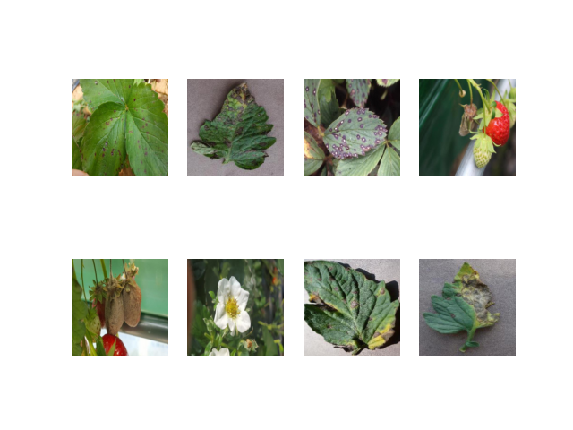
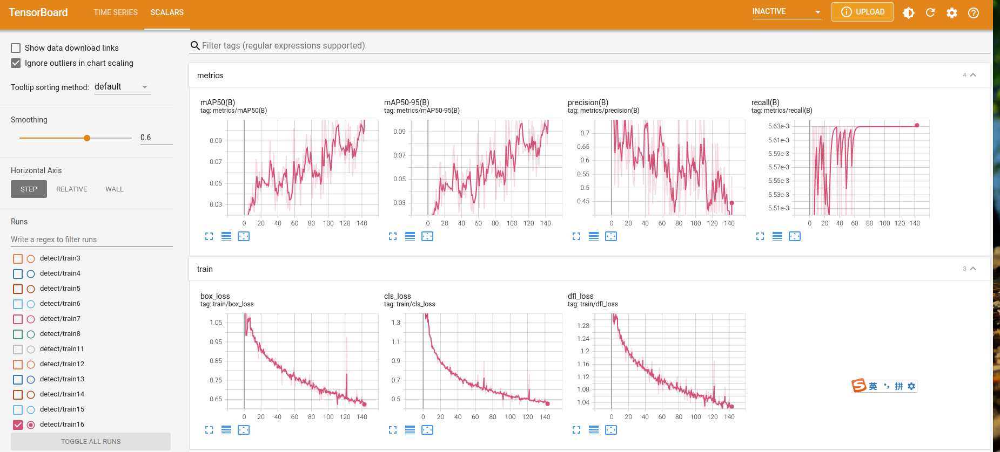
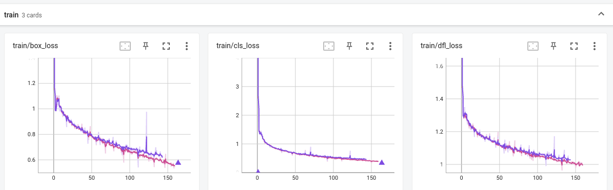
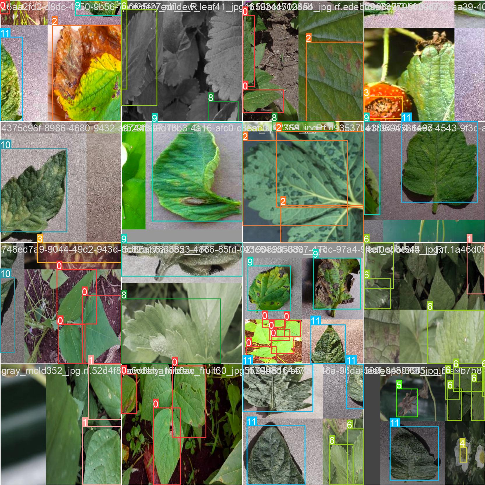
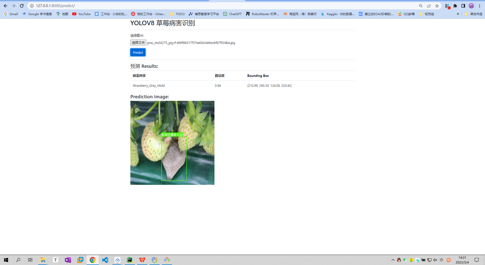
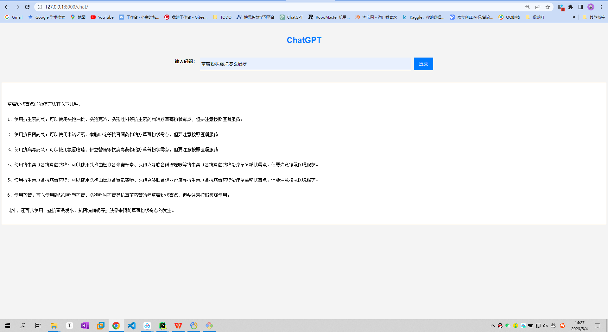
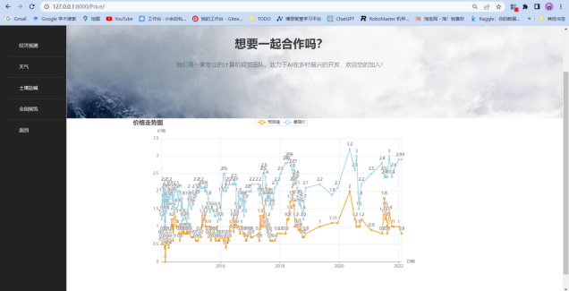
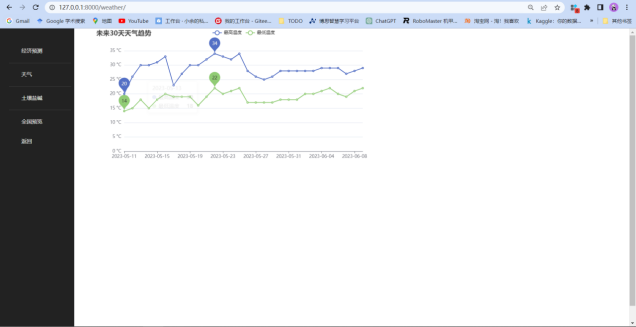
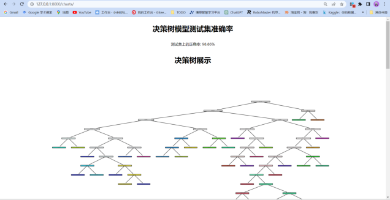
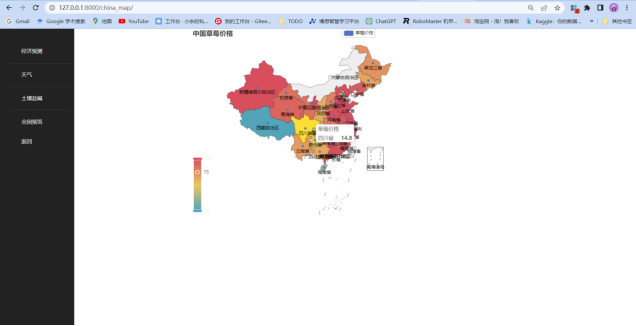

---

# 安徽信息工程学院大三下实践项目

欢迎:star:🥰

联系方式：1465739029@qq.com

---

**人员分工：**
<div align="center">

| 姓名   | 班级           | 分工       |
| ------ | -------------- |----------|
| 余铭杰 | 人工智能2002班 | 深度学习，数据流 |
| 刘樾昕 | 人工智能2002班 | 前后端，MVC  |
| 常欣   | 人工智能2002班 | 文档、数据库   |

</div>

**环境需求：**
ultralytics、Django、pymysql、openai...

    详见`requirments.txt`

**数据库：**

    详见`sql/crop.sql`

## 功能描述
> 使用Django实现智能系统开发，结合计算机视觉和自然语言处理以及机器学习算法。
---

### **1、病虫害识别**

#### 数据集展示



* 识别种类：

                            0: '豆角角斑病',
                            1: '豆角锈病',
                            2: '草莓角斑病',
                            3: '草莓炭疽病',
                            4: '草莓花叶枯萎病',
                            5: '草莓灰霉病',
                            6: '草莓叶斑病',
                            7: '草莓粉霉病（果实）',
                            8: '草莓粉霉病（叶片）',
                            9: '番茄晚疫病',
                            10: '番茄叶',
                            11: '番茄蜘蛛螨'

#### 使用模型：

- yolov8s训练过程展示（16系列垃圾显卡，能用就行）
  





#### 工作流程：

* 输入图像被转换为 float32 类型的 NumPy 数组并传递给 YOLOv8 对象检测模型。
  该模型对图像执行对象检测，并生成一个 JSON 对象，其中包含所有对象的名称及其在图像中各自的置信度。

#### 效果展示：



### **2、农户问答**

#### 效果展示:



### **3、农作物价格预测**

* 功能：以七天窗口为周期预测下一天的数据，在```tools/LSTM_teat.py```有测试。
* 功能展示：



### **4、天气展示**



### **5、决策树分析**




### **6、全国均价展示**





### 使用websockets在django上实现chatgpt实时的问答机器人

1. 安装并配置Channels库：Channels是一个能够让Django支持异步处理请求的库，可以用于实现WebSocket通信和异步任务等功能。需要先安装Channels库，并在settings.py中进行相关配置。
2. 创建WebSocket消费者类：创建一个继承自AsyncWebsocketConsumer的类，并实现connect、disconnect和receive等方法。其中，connect方法会在客户端建立WebSocket连接时调用，disconnect方法会在客户端断开WebSocket连接时调用，receive方法会在接收到客户端发送的消息时调用。
3. 集成ChatGPT模型：将ChatGPT模型集成到WebSocket消费者类中，当接收到客户端的消息时，调用ChatGPT模型进行问答处理，并将结果返回给客户端。
4. 前端页面实现：创建前端页面，用于用户输入问题并接收服务器返回的回答。在前端页面中使用JavaScript编写代码，与后端进行WebSocket通信，并实现将用户输入的内容发送到服务器，接收服务器返回的回答并展示在页面上。

通过使用WebSocket协议，可以实现双向通信，使得服务器和客户端之间可以实现实时的数据交换，从而达到实时问答的效果

### LSTM的背后实现

基于LSTM的草莓价格预测模型。主要思路是，将历史的草莓价格数据作为输入序列，使用LSTM模型进行训练，得到一个能够预测未来草莓价格的模型。

具体实现步骤：

1. 从MySQL数据库中读取草莓价格数据，并对数据进行处理和归一化。
2. 根据给定的时间窗口大小，生成训练集和测试集。
3. 构建LSTM模型，并使用训练集对模型进行训练。
4. 对测试集进行预测，并将预测结果反归一化，得到真实的草莓价格。
5. 对预测结果和真实草莓价格进行可视化展示。

LSTM模型是一种适用于时间序列数据的神经网络模型，它可以通过学习历史数据的规律来预测未来数据。相比于传统的时间序列分析方法，LSTM模型更加灵活，可以处理非线性关系、长期依赖等问题，因此在时间序列预测方面有着广泛的应用。

在草莓价格预测中，LSTM模型可以利用历史的草莓价格数据，捕捉价格的周期性变化、趋势变化和季节性等特征，从而对未来的草莓价格进行预测。

**超参数介绍**

1. DAYS_FOR_TRAIN: 用于训练的时间窗口大小，即取多少天的数据作为输入。
2. num_layers: LSTM模型的层数。
3. hidden_size: LSTM模型中隐藏状态的维度。
4. lr: 模型训练时的学习率。
5. num_epochs: 模型训练的轮数。

**如何生成未来数据**

1. 使用create_future_input_sequence函数生成未来十天的输入序列，该函数将最近DAYS_FOR_TRAIN天的历史数据作为输入，然后使用模型对未来的价格进行预测。
2. 将生成的输入序列转换为PyTorch的张量格式，并通过模型进行前向传播，得到未来十天的价格预测结果。
3. 对预测结果进行反归一化，得到真实的草莓价格。

### 关键功能模块

- 监测模块：使用YOLOV8对草莓种植过程中的多种因素进行监测和分析，包括成熟度、病虫害信息等。

- 预测模块：基于LSTM算法对作物价格走势进行预测，帮助农民做出更明智的销售决策。

- 问答模块：使用ChatGPT问答系统解决农户的问题，帮助农民解决实际生产问题。

- 数据分析模块：利用echarts提供给农户更为全面的气象播报、土壤情况盐碱性的分析治理，使农民更好地了解农作物生长环境，提高农作物的产量和品质。

- 市场行情展示模块：展示全国草莓均价的展示，帮助农民了解市场行情，更好地规划生产和销售策略。

- 管理模块：管理用户信息、数据信息等，保证系统运行的正常稳定。

- 消息模块：展示当前地点气象信息及土壤状态。

---
参考资料：
https://blog.csdn.net/qq_30006795/article/details/124722870

---
东西写的有点乱，仅供参考